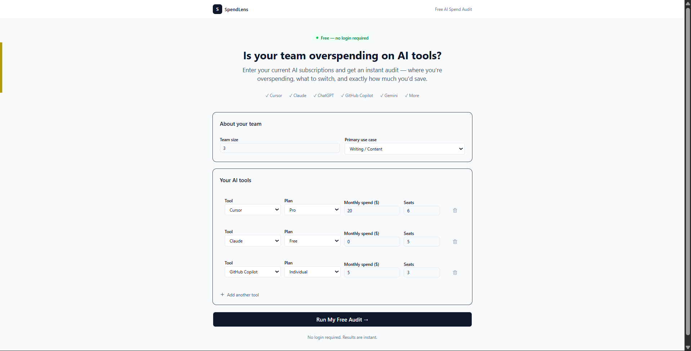
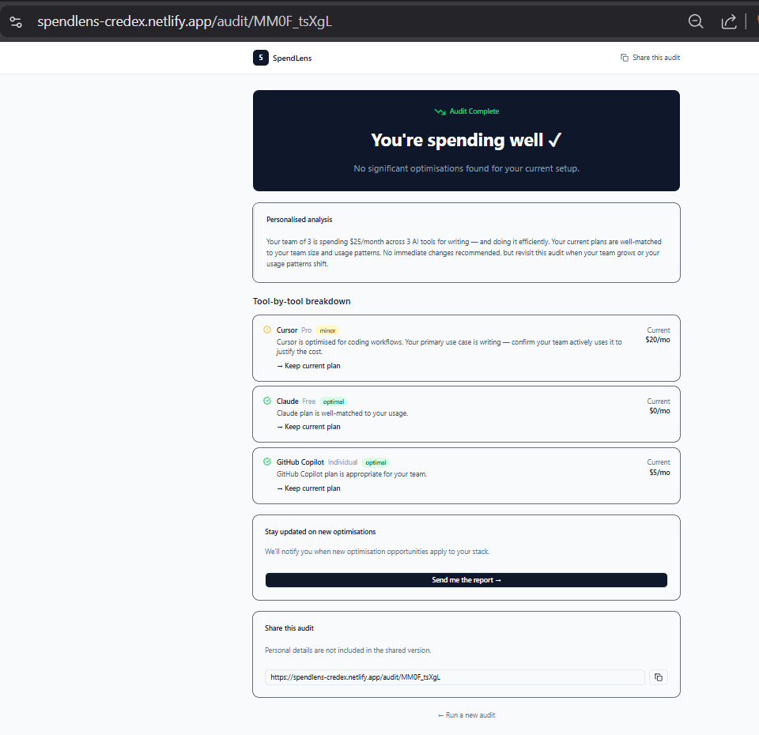
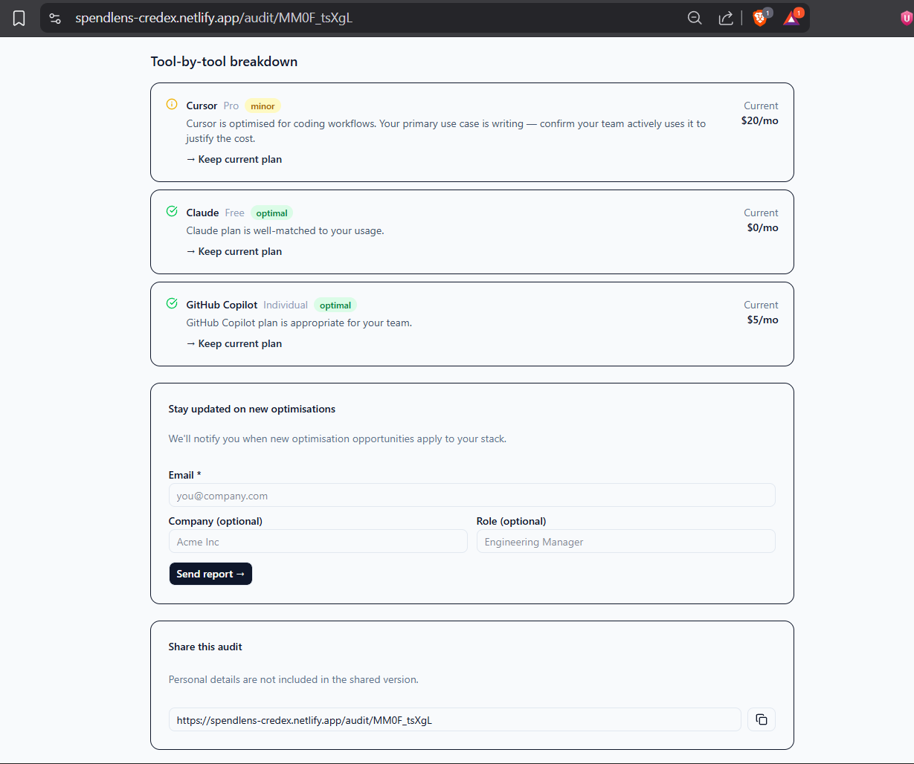

# SpendLens

SpendLens is a free AI spend auditor for startup founders and engineering managers — enter your team's AI tool subscriptions and get an instant audit showing where you're overspending, what to switch, and your total potential monthly and annual savings. No login required.

🌐 **Live:** https://spendlens-credex.netlify.app

---

## Screenshots





---

## Quick Start

```bash
git clone https://github.com/Avinashborem/spendlens
cd spendlens
npm install
cp .env.example .env.local
# Fill in your keys in .env.local
npm run dev
```

Open [http://localhost:3000](http://localhost:3000).

### Environment variables

```
NEXT_PUBLIC_SUPABASE_URL=
NEXT_PUBLIC_SUPABASE_ANON_KEY=
SUPABASE_SERVICE_ROLE_KEY=
RESEND_API_KEY=
ANTHROPIC_API_KEY=
NEXT_PUBLIC_APP_URL=
```

### Run tests

```bash
npm test
```

### Deploy

```bash
npm install -D @netlify/plugin-nextjs
netlify deploy --prod
```

---

## Decisions

**1. No login required on the free tier**
Every login screen loses a significant portion of users before they see any value. We show the audit result first, capture email after. The shareId in the URL is the only session state — no auth needed. Trade-off: we can't associate multiple audits with one user account, which limits retention features. Acceptable for MVP.

**2. Hardcoded rules for the audit engine, not an LLM**
The assignment brief is explicit: "for the audit math itself, hardcoded rules are correct — knowing when not to use AI is part of the test." Hardcoded rules are deterministic and auditable (a finance person can verify every number), instant with no API latency, free at scale, and cannot hallucinate a savings figure. The one place AI genuinely adds value — the personalized summary paragraph — is where we use it.

**3. Netlify over Vercel**
Started on Vercel, hit a bom1 routing error on every URL — an account-level routing issue after Pro trial cancellation, not a code bug. Switched to Netlify with `@netlify/plugin-nextjs`. Same codebase deployed cleanly on first attempt. Netlify's plugin handles App Router serverless functions automatically.

**4. Supabase over Firebase or raw Postgres**
Supabase gives managed Postgres with a REST API, Row Level Security for future auth, and a generous free tier. Firebase is document-oriented which doesn't fit the relational audit + leads schema. A raw Render Postgres would need more setup time. Trade-off: Supabase free tier has connection limits that would need pgBouncer at scale.

**5. UUID shareId over sequential IDs**
Shareable report URLs use a UUID rather than an integer ID (e.g. `/audit/abc123` not `/audit/42`). This prevents enumeration attacks — a bad actor can't scrape all audit results by incrementing an integer. Trade-off: URLs are less readable, but they're shared as links, not typed manually.

---

## Project Structure

```
spendlens/
├── src/
│   ├── app/
│   │   ├── page.tsx                  # Landing page + audit form
│   │   ├── api/
│   │   │   ├── audit/route.ts        # Audit processing + Supabase save
│   │   │   └── lead/route.ts         # Lead capture + Resend email
│   │   └── audit/[shareId]/
│   │       └── page.tsx              # Shareable results page
│   ├── components/
│   │   ├── SpendForm.tsx             # Audit input form with localStorage
│   │   └── AuditResults.tsx          # Results page component
│   └── lib/
│       ├── audit-engine.ts           # Core audit logic (hardcoded rules)
│       ├── pricing-data.ts           # Tool pricing constants
│       ├── supabase.ts               # Supabase client
│       └── types/                    # TypeScript domain types
├── __tests__/
│   └── audit-engine.test.ts          # Vitest test suite (8 tests)
├── .github/workflows/ci.yml          # CI — lint + test on every push
├── netlify.toml                      # Netlify deployment config
└── public/screenshots/               # App screenshots
```
